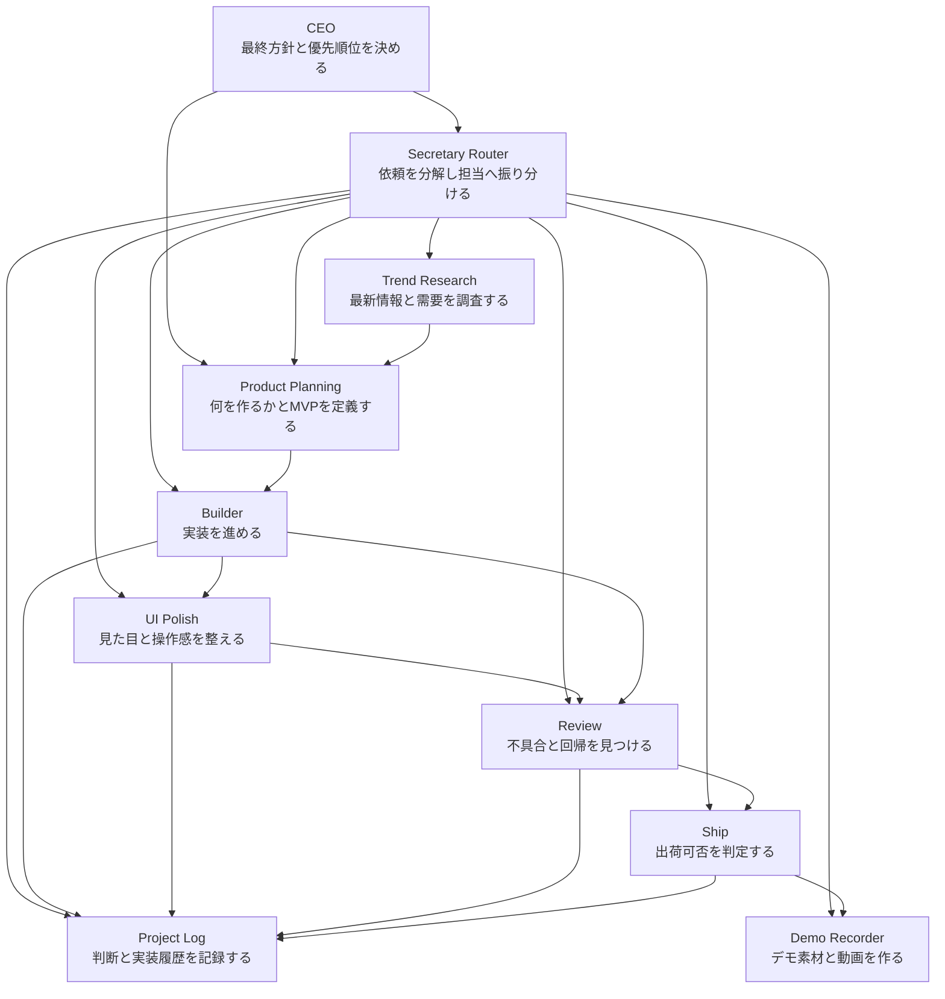

# Agent Company 組織図

## ミッション

最新の外部情報を継続的に調査し、需要のあるアプリ案を選び、素早く実装し、厳密にレビューし、その過程を再利用可能な知識として蓄積する。

## 組織図

## 役割

### 1. CEO

- 事業の方向性と最終優先順位を決める
- どの機会をプロダクトに変えるかを判断する
- スピード、品質、スコープのトレードオフを承認する

### 2. Secretary Router

- すべての依頼の受付窓口になる
- 曖昧な依頼を具体的なタスクに分解する
- 必要最小限の確認だけ行い、適切な担当へルーティングする

### 3. Trend Research

- 最新の外部情報を収集する
- 需要、競合、市場変化、技術機会を追う
- 企画がそのまま使える形で調査結果を構造化する

### 4. Product Planning

- 調査結果からアプリ案、MVP、優先順位を決める
- 誰のどんな痛みを、なぜ今解くのかを定義する

### 5. Builder

- 承認済みのスコープを実装する
- 変更を小さく、検証しやすく、段階的に保つ

### 6. UI Polish

- 実装済みアプリの見た目、情報階層、操作導線を整える
- デモ前やレビュー前に第一印象と理解しやすさを上げる

### 7. Review

- マージ前に不具合、回帰、契約不整合、テスト不足を見つける

### 8. Ship

- 検証結果を確認し、マージまたはリリース可否を判定する

### 9. Project Log

- 判断、実装の節目、検証結果を記録する
- 次回以降に再利用できるプロジェクト記憶を作る

### 10. Demo Recorder

- スクリーンショット、台本、動画などのデモ素材を作る

## 指揮系統

- CEO が最終方針を持つ
- Secretary Router が依頼を受けて各役割を調整する
- Trend Research と Product Planning が CEO の判断材料を作る
- Builder、UI Polish、Review、Ship、Project Log、Demo Recorder が承認後の実行を担う

## 標準フロー

1. CEO またはユーザーが目標を出す
2. Secretary Router が目標をタスクに分解して担当を割り当てる
3. 最新情報が必要なら Trend Research が証拠を集める
4. Product Planning が作るべき案と MVP を定義する
5. Builder が承認済みスコープを実装する
6. UI Polish が必要に応じて画面の見た目と導線を整える
7. Review が変更のリスクを点検する
8. Ship が出荷可否と残リスクを整理する
9. Project Log が判断と作業結果を記録する
10. Demo Recorder が必要に応じてデモ素材を作る

## 初期実装順

1. Secretary Router
2. Trend Research
3. Product Planning
4. Builder
5. Project Log
6. UI Polish
7. Demo Recorder

この順番にすると、入口、最新情報、企画、実装、記録、UI改善、実行支援を先に整えたうえで組織を拡張できる。
