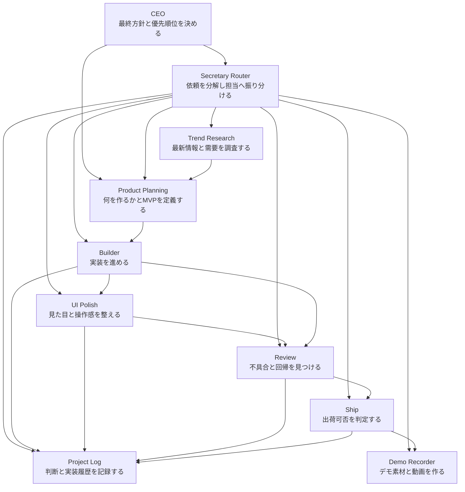

# agent_company

Codex の agent skills を使って、`調査 -> 企画 -> 設計 -> 実装 -> UI改善 -> レビュー -> 出荷確認 -> 記録` を役割分担で進めるためのリポジトリです。

この repo は、1つの AI に全部まとめて頼むのではなく、役割ごとに skill を切り替えて「会社のように動かす」ことを目的にしています。

## これは何か

このリポジトリには、以下の2種類が入っています。

- 組織の設計
  - どの role が何を担当するか
  - どの順で仕事を流すか
- Codex 用 skill
  - 各 role が従う `SKILL.md`
  - UI に表示される `agents/openai.yaml`

## 想定している使い方

この repo は、次のようなケースを想定しています。

- 最新情報を調べて、需要の高そうなアプリ案を見つけたい
- 見つけた案を MVP に落とし込みたい
- そのまま Codex に実装、レビュー、出荷確認まで進めてほしい
- 作業の経緯を Markdown で残したい
- 作ったアプリや成果物を短い紹介動画として残したい

## 組織モデル



### 役割

- `CEO`
  - 最終方針と優先順位を決める
- `secretary-router`
  - 依頼を分解し、どの skill に回すか決め、必要なら最後まで進行管理する
- `trend-research`
  - 最新の外部情報を調べる
- `product-planning`
  - 調査結果から、作るべきプロダクト案と MVP を決める
- `builder`
  - 実装を進める
- `ui-polish`
  - 見た目と操作感を整える
- `gstack-review`
  - 不具合、回帰、テスト不足を見つける
- `gstack-ship`
  - 最終確認と handoff を行う
- `project-log`
  - 判断と作業履歴を残す
- `demo-recorder`
  - Playwright と Remotion を使ってデモ素材や紹介動画を作る

### 基本フロー

1. `secretary-router` で依頼を分解する
2. 必要なら `trend-research` で最新情報を調べる
3. `product-planning` で何を作るかを決める
4. `gstack-plan-eng-review` で実装方針を固める
5. `builder` で実装する
6. 必要なら `ui-polish` で見た目を整える
7. `gstack-review` でレビューする
8. `gstack-ship` で最終確認する
9. `project-log` で記録を残す
10. 必要なら `demo-recorder` で動画化する

## フォルダ構成

- `AGENTS.md`
  - この workspace で使う skill 一覧と使い分け
- `.agents/skills/`
  - 各 role の `SKILL.md`
  - `secretary-router`
  - `trend-research`
  - `product-planning`
  - `builder`
  - `ui-polish`
  - `project-log`
  - `demo-recorder`
  - `playwright-cli`
  - `gstack-plan-eng-review`
  - `gstack-review`
  - `gstack-ship`
- `video/`
  - Remotion を使った動画テンプレート
  - `demo-recorder` が使う動画生成基盤
- `demo/`
  - ローカルで作るアプリの生成物置き場
  - Git 管理外
- `logs/`
  - ローカルで残す作業ログ置き場
  - Git 管理外

## まず読むファイル

1. `README.md`
2. `AGENTS.md`
3. 必要な role の `SKILL.md`

最初にこの README で全体像を掴み、その後 `AGENTS.md` で使える skill を見てください。

## Skill 一覧

### `secretary-router`

広い依頼を具体的なタスクへ分解し、どの role に回すかを決め、必要なら最後まで進める実行ディレクター役です。

使う場面:
- 依頼が曖昧
- 複数の工程が混ざっている
- まず何から始めるべきか決めたい
- 調査から実装、動画化までを一気通貫で進めたい

### `trend-research`

最新の外部情報を調査し、需要、競合、市場変化を整理する役です。

使う場面:
- 今何を作るべきか探したい
- 最近の制度改正や市場変化を踏まえたい
- 需要や競争の状況を把握したい

### `product-planning`

調査結果を、対象ユーザー、差別化、MVP、優先順位が明確なプロダクト案に変える役です。

使う場面:
- 調査結果をそのまま実装せず、一度企画に落としたい
- MVP をどこで切るか決めたい
- 何を作らないかを明確にしたい

### `gstack-plan-eng-review`

実装前に技術設計を圧縮する役です。

使う場面:
- 実装方針を固めたい
- 失敗しやすい設計を避けたい
- テスト観点を先に整理したい

### `builder`

企画や設計を、実際のコード変更に落とす実装役です。標準プリセットとして、React、Node.js + Express、JSON ベースの擬似データ層、独自 API を持ちますが、これは必須ではなく第一選択です。

使う場面:
- 機能追加
- MVP 作成
- 既存コードの小さな拡張

### `ui-polish`

実装済みアプリの見た目、情報階層、導線、モバイル対応を整える役です。

使う場面:
- 見た目が素っ気ない
- 情報が読みにくい
- デモ前に第一印象を良くしたい

### `gstack-review`

不具合、回帰、契約不整合、テスト不足を探すレビュー役です。

使う場面:
- 実装後レビュー
- マージ前確認
- 品質リスクの洗い出し

### `gstack-ship`

最終確認と引き渡しを行う役です。

使う場面:
- 検証をまとめたい
- merge-ready / blocked を判断したい
- 最後の handoff を整理したい

### `project-log`

調査、企画、実装、検証の内容を Markdown に残す記録役です。

使う場面:
- 後で経緯を追いたい
- 実装理由を残したい
- 作業内容を次回へ引き継ぎたい

### `demo-recorder`

実装済みアプリや agent_company の成果を、Playwright で取得した画面素材と Remotion を使って短いデモ動画に変える役です。

使う場面:
- 成果物を紹介したい
- デモ動画を作りたい
- 作業結果を動画として残したい

### `playwright-cli`

ローカルアプリや外部サイトをブラウザで操作し、スクリーンショットや簡易 QA 素材を取る役です。主に `demo-recorder` の前段で使います。

使う場面:
- 実アプリの画面素材を取りたい
- 主要導線を手元で再現したい
- デモ動画用のスクリーンショットを安定して保存したい

### 動画プロジェクト

動画生成には [video/README.md](/Users/ryota/Desktop/エージェント作成/agent_team/video/README.md) の Remotion プロジェクトを使います。
現時点では、`AgentCompanyShowcase`、`SkillSprintCoachShowcase`、`CapturedAppShowcase` の composition を用意しています。

## 推奨ワークフロー

基本は次の順です。

1. `secretary-router`
2. `trend-research`
3. `product-planning`
4. `gstack-plan-eng-review`
5. `builder`
6. `ui-polish`
7. `gstack-review`
8. `gstack-ship`
9. `project-log`
10. `demo-recorder`

すべて毎回使う必要はありません。  
例えば既に作るものが決まっているなら、`trend-research` と `product-planning` は省略できます。

## 動画の使い方

Remotion を使った動画生成は `video/` 配下で行います。

```bash
cd /Users/ryota/Desktop/エージェント作成/agent_team/video
npm install
npm run studio
```

既存テンプレートの出力例:

```bash
npm run render:agent-company
npm run render:skill-sprint-coach
```

生成物は `video/renders/` に出力され、Git 管理外です。

## 実際の呼び方

### 例1: 今作るべきアプリを探す

```text
$secretary-router
最新情報を踏まえて、需要がありそうなアプリ案を調査から企画まで分解して
```

```text
$trend-research
2026年時点の最新情報で、個人開発でも勝ち筋がありそうな子育て支援アプリの機会を調べて
```

```text
$product-planning
この調査結果から、最初に作るべき1案とMVPを定義して
```

### 例2: 実装まで進める

```text
$gstack-plan-eng-review
このMVPをどう実装するか、設計とリスクを先に整理して
```

```text
$builder
この計画に沿って実装して
```

```text
$ui-polish
このアプリの情報階層と見た目を整えて
```

```text
$gstack-review
今の差分をレビューして
```

```text
$gstack-ship
最後の確認まで進めて
```

```text
$project-log
今回の作業内容をログに残して
```

## ローカル生成物について

この repo では、以下は Git 管理しない前提です。

- `demo/`
- `logs/`

理由:
- アプリ試作物や実験コードはセッションごとに変わりやすい
- ログはローカル作業履歴として扱いたい
- repo 自体は「会社の仕組み」と skill 定義を保つことに集中したい

必要なら、自分の運用に合わせて `.gitignore` を変更してください。

## セットアップの前提

- Codex からこの workspace を開けること
- `.agents/skills/` を読む運用であること
- `AGENTS.md` を参照すること

特別な依存は必須ではありません。  
ただし、今後 `browser-qa` や動画化を足す場合は Playwright や ffmpeg のような追加ツールが必要になります。

## 今後の拡張候補

- `browser-qa`
- `demo-recorder`
